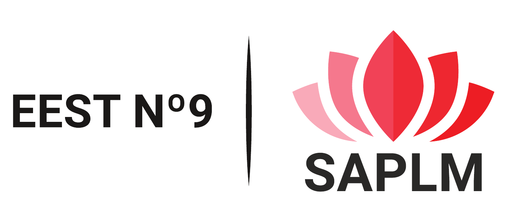

# SAPLM

  

## Description
SAPLM “Sistema Auxiliar para Personas con Limitaciones Motrices” (English: Auxiliary System for People with Mobility impairments) was a technical school final year project that aimed to develop a system that helped people with mobility impairments to control appliances and communicate with others by just using their voice.

The system itself could be categorized as a home automation system but heavily thought of as an extension of a clinical setup. 

## Project members and involved institutions
The project development and testing were mainly carried out at the school facilities, E.E.S.T. N°9 Prof. Antonio Jose Rodriguez.

As project developers: Da Cruz, Agustín; Villegas, Rocío; Zatloukal Maule, Julián.

As project supervisors: Otero, Diego; Castro, Pujol; Della Paolera, Sergio

## Project Outcome
During all of 2019 from February to the end of November as a group of three, we developed the project and made progress almost every day throughout the year.
The final result allowed the user to use their voice as a trigger of electric appliances such as an electric fan, a bulb, a desk lamp, an electric stove, and even control a small curtain.
The Android application used Google's voice-to-speech API to recognize the user’s speech and send the text to the main board and then fulfill the action.

## Technologies, languages, and programs used
- Mobile Application
  - Android SDK with Java 8 (mobile application)
  - Android Studio
  - Google text-to-speech API
  - Airbnb/epoxy library
- Hardware system
  - AVR GCC (microcontroller’s firmware)
  - Atmel Studio
  - ATmega88PA and ATmega328P
  - CAD Eagle PCB design tool
  - Handmade PCB prototyping
  - Bluetooth Module HC-05
  - 2.4 GFSK connectivity with nRF24L01 module
  - UART and SPI communication
- Project
  - Adobe Illustrator and Adobe Xd
  - Lucid chart	
  - Material IO Icons
